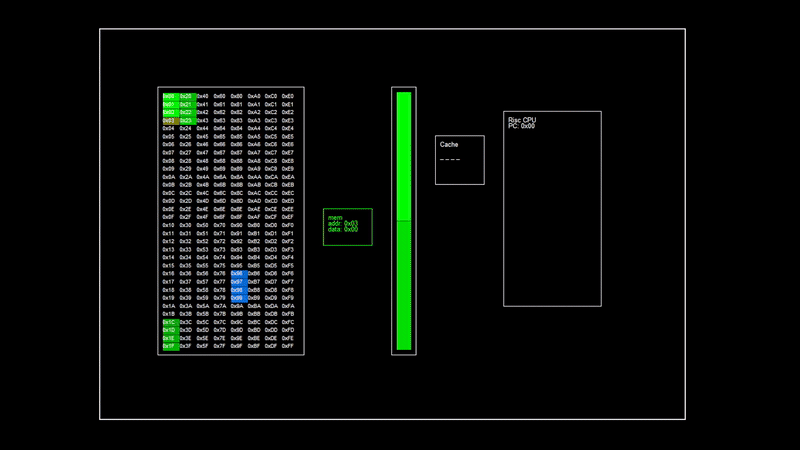

# embellish
video synthesis based on a risc-v softcore

the goal of this project is to have a modular system for running parallel cpus to produce video.

## Risc-V softcore

I started by writing a RISC-V soft core in amaranth. It is based on RV32I base instruction set. I have yet to implement branches, but most instructions run.

### Visualizer

Spent some time making a visualizer, which runs off the amaranth simulator. The simulation shows memory access, instruction caching and switch use. The gif shows an infinite loop, which loads one word into memory.



### Testing

A simple test runs sucessfully:

```python
def test_set_reg_to_value(self):
        prog = list()
        
        prog.append(InstructionBuilder.andi(0, 0, 0)) # Clear register (and with 0)
        prog.append(InstructionBuilder.addi(11, 0, 0)) # add constand to register
        
        prog.append(InstructionBuilder.andi(0, 1, 1)) # Clear register 0
        prog.append(InstructionBuilder.addi(13, 1, 1)) # add constant
        
        # Store word at register 1 (13) with value from register 0 (11)
        prog.append(InstructionBuilder.storeword(0, 0, 1))
        
        prog = [p.value() for p in prog]
        
        dut, core, prog = core_with_program(prog)
        
        async def mem_process(ctx):git
            assert await receive(ctx, core.bus) == (13, 11, 1)
            assert await receive(ctx, core.bus) == (14, 0, 1)
            assert await receive(ctx, core.bus) == (15, 0, 1)
            assert await receive(ctx, core.bus) == (16, 0, 1)
                
        sim = Simulator(dut)
        sim.add_clock(1e-8)
        sim.add_testbench(mem_process)
        
        with sim.write_vcd("bench/risc_set_reg.vcd"):
            sim.run()
```

`InstructionBuilder` is a quick utility for putting together risc instructions.